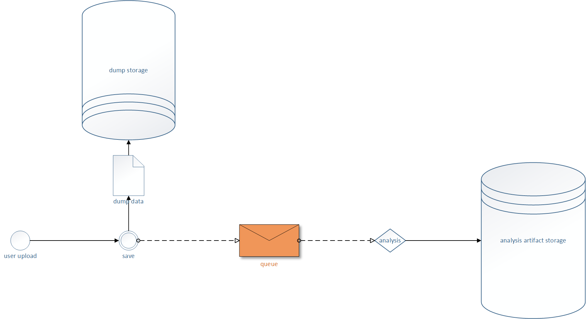

##`dumpling`
#####What is `dumpling`?

`dumpling` is the name of the DotNet dump analytics and storage service. Given a dump file, the service extracts information and catalogues it for future review.

#####The Vision
A runtime developer is looking for bugs to fix, and visits the `dumpling` website. They are presented with a view of the most impactful runtime issues. If they come across a failure they'd like to investigate, they may download the offending zipped up dump file and extract it to their machines for further review.

##### -`The Status`The Pieces

1. Supported Users
   - Automated Infrastructure
   - Tools
   - Humans
2. `todo`RESTful Front-End
   - `todo`**upload dump file**
   - `todo` Get Status
   - `todo` Retrieve Dump File
3. `todo` Status Table
4. `todo` ** dump + runtime artifacts storage **
5. `stable`**analysis** Infrastructure
	- (**queue**) Azure Topic
	- Workers
		- Ubuntu 14.04 VM
		- CentOS VM
6. `todo` ** analysis artifacts storage **
7. `todo` Report Viewing
   - `todo` PowerBI for high-level status
   - `todo` ASP.Net WebViews for actionable data

#####The Gap Tasks
These are the remaining actionable tasks to meet the bare-minimum of our vision.

1. Bring up SQL Database
    - `sschaabs` has a code-first Entity Framework base laid out that has withstood the test of time.
2. Create REST Interface
	- (POST) AddDump
	- (GET) GetStatus
	- (GET) RetrieveDump
	- (POST/UPDATE) Update/AppendData
	- (methods) APIs for retrieving results to pre-defined SQL queries.
3. Spawn State Table
4. Create web view that displays the results of our dumps.
	- Write SQL queries to be displayed
	- PowerBI (pass success)
	- Write HTML/JavaScript to be viewed.
	- Adjusted/Unadjusted mean time to failure.

